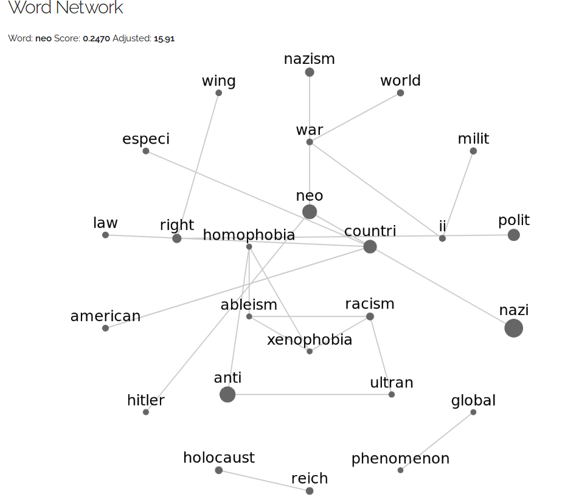
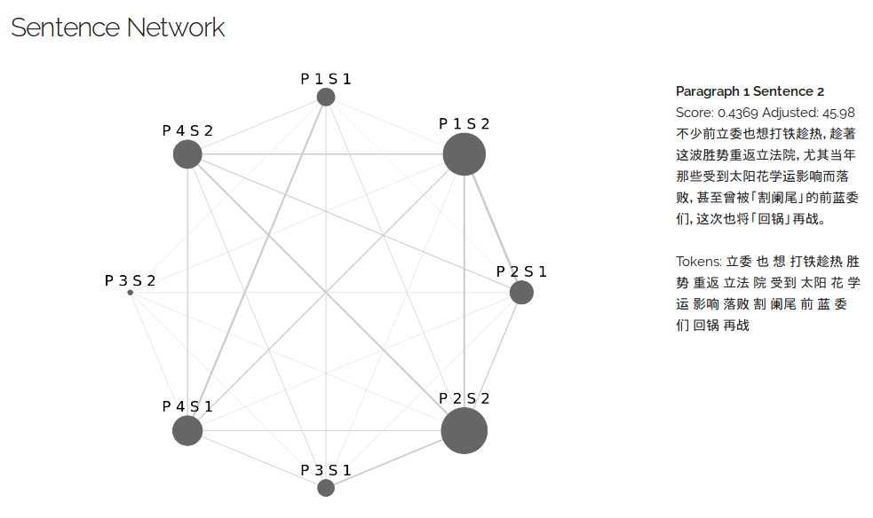
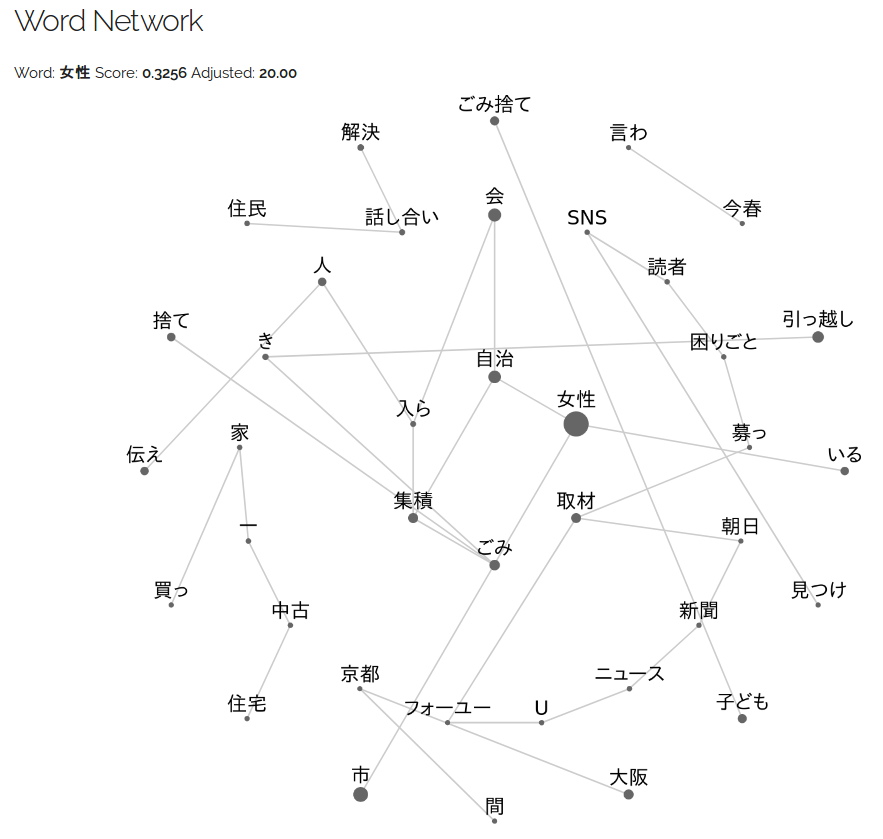

# TextRank Demo

A simple website demonstrating TextRank's extractive summarization capability. Currently supports English and Chinese.

## Usage

* This project uses Starlette (a lightweight ASGI framework/toolkit), so **Python 3.6+** is required.

* Install dependencies by running `pip install -r requirements`.

* Start the demo server by running `python demo.py`, and then visit `http://localhost:8000` in your browser.

(Depending on your Python setup, you might need to replace `pip` with `pip3`, and `python` with `python3`.)

WARNING: At the current state, the backend does almost to none input value validation. Please do not anticipate it to have production quality.

## Languages supported

### English

Demo: **[A static snapshot](https://publicb2.ceshine.net/file/ceshine-public/misc/textrank_demo.html) with an example from Wikipedia.**

This largely depends on language preprocessing functions and classes from [summanlp/textrank](https://github.com/summanlp/textrank). This project just exposes some of their internal data.

Accoring to [summanlp/textrank](https://github.com/summanlp/textrank), you can install an extra library to improve keyword extraction:

> For a better performance of keyword extraction, install Pattern.

From a quick glance at the source code, it seems to be using Pattern (if available) to do some POS tag filtering.

### Chinese

Demo: **[A static snapshot](https://publicb2.ceshine.net/file/ceshine-public/misc/textrank_demo_zh.html) with an example from a news article.**

This project uses [Baidu's free NLP API](https://cloud.baidu.com/product/nlp) to do word segmentation and POS tagging. You need to create an account there, install the Python SDK, and set the following environment variables:

* BAIDU_APP_ID
* BAIDU_APP_KEY
* BAIDU_SECRET_KEY

You can of course use other offline NLP tools instead. Please refer to `test_text_cleaning_zh.py` for information on the data structures expected by the main function.

Traditional Chinese will be converted to Simplified Chinese due to the restrictions of Baidu API.

### Japanese

Demo: **[A static snapshot](https://publicb2.ceshine.net/file/ceshine-public/misc/textrank_demo_ja.html) with an example from a news article.**

It uses [nagisa](https://github.com/taishi-i/nagisa) to do word segmentation and POS tagging. There are some Japanese peculiarities that make it a bit tricky, and I had to add a few stopwords go get more reasonable results for demo. Obviously there is much room of improvement here.

## Snapshots

### English

### Chinese

### Japanese

